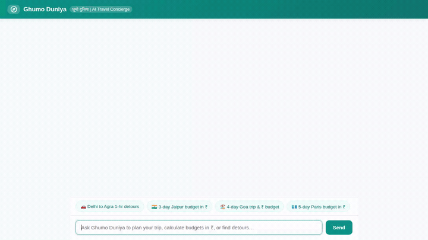

# Ghumo Duniya (घूमो दुनिया) 🌍

> An intelligent, agent-first travel concierge and road trip companion built with the **Agent Development Kit (ADK)**, **agents-cli**, and **Google Cloud**.



---

## Overview

**Ghumo Duniya** is an AI travel concierge designed to help travelers plan personalized road trips, explore curated travel spots, generate destination visual postcards, and estimate multi-day budgets in Indian Rupees (INR - ₹).

Unlike standard chatbots, Ghumo Duniya uses the **Agent Development Kit (ADK)** with structured tool calling, cross-session memory, structured NoSQL storage, serverless code sandboxing, and **A2UI** (Agent-to-User Interface) to render interactive display cards rather than walls of plain text.

---

## ⚡ What the Agent Does (Implemented Capabilities)

All features below are implemented directly in [`app/agent.py`](app/agent.py) and [`frontend/`](frontend/):

- 🚗 **Road Trip & 1-Hour Detour Routing**: Calculates driving routes between any two cities via OpenStreetMap & OSRM routing. Analyzes highway corridors and discovers 1-hour detours tailored to trip themes (*spiritual*, *fun*, *scenic*, *historic*, *food*).
- 🗄️ **Firestore Travel Catalog**: Searches and retrieves attractions, cultural spots, and activities from a managed Cloud Firestore database, filtered by city, category, and budget tier.
- 💾 **Itinerary Persistence**: Saves and retrieves user travel plans in Cloud Firestore (`itineraries` collection).
- 💰 **Itemized Trip Budget Estimation**: Calculates lodging, meals, transit, and activity costs for any destination and traveler count, with all pricing standardized in **Indian Rupees (INR - ₹)**.
- 🌤️ **Live Destination Weather**: Fetches real-time weather and multi-day forecasts with precipitation probability using Open-Meteo APIs.
- 🎨 **Scenic Image Generation & Cloud Storage**: Generates travel postcards using `gemini-3.1-flash-lite-image` and automatically uploads them to Google Cloud Storage to serve public image cards.
- 🧠 **Cross-Session Long-Term Memory**: Recalls traveler preferences, dietary restrictions, past visited spots, and favorite destinations across conversations using Vertex AI Memory Bank.
- 🧪 **Code Sandbox Execution**: Runs Python code safely in the Agent Engine sandbox for precise currency calculations and schedule math.
- 🪟 **Agent-to-User Interface (A2UI)**: Renders structured visual cards, columns, and rows directly in the web UI via A2UI v0.8 Basic Catalog.

---

## ☁️ Google Cloud Services & Architecture

| Layer | Service / Technology | Implementation in Code |
|---|---|---|
| **Agent Reasoning** | Gemini 2.5 Flash via ADK | Defined in `app/agent.py` using `google.adk.agents.Agent` and `Gemini(model="gemini-2.5-flash")` |
| **Long-Term Memory** | Vertex AI Memory Bank | `LoadMemoryTool()` + `after_agent_callback=generate_memories_callback` (`add_session_to_memory`) |
| **Database** | Google Cloud Firestore | `db = firestore.Client()` querying `travel_spots` and `itineraries` collections |
| **Object Storage** | Google Cloud Storage (GCS) | `storage_client = storage.Client()` saving generated postcards to a public storage bucket |
| **Image Generation** | Google GenAI SDK | `genai_client.models.generate_content(model="gemini-3.1-flash-lite-image")` |
| **Code Execution** | Agent Engine Sandbox | `AgentEngineSandboxCodeExecutor(sandbox_resource_name=...)` |
| **Rich UI** | A2UI (v0.8 Basic Catalog) | `A2uiSchemaManager`, `a2ui_callback`, and client-side card renderer in `frontend/static/index.html` |
| **Protocol** | Agent-to-Agent (A2A) | FastAPI proxy in `frontend/main.py` routing requests to Agent Runtime over A2A |

---

## 📋 Feature Status & Scope

To ensure complete transparency regarding what is implemented versus roadmap items from the initial design brief:

| Feature | Status | Notes |
|---|---|---|
| Road Trip 1-Hr Detours | ✅ Implemented | Free OpenStreetMap & OSRM routing (`suggest_roadtrip_detours`) |
| Firestore Travel Spots Catalog | ✅ Implemented | Seeded and live in `travel_spots` collection (`search_travel_spots`, `save_travel_spot`) |
| User Itinerary Storage | ✅ Implemented | Firestore `itineraries` collection (`save_user_itinerary`, `get_user_itinerary`) |
| INR (₹) Budget Calculations | ✅ Implemented | Standardized across model instructions, tools, and UI |
| Live Weather Lookups | ✅ Implemented | Open-Meteo API integration (`get_destination_weather`) |
| Travel Postcard Image Generation | ✅ Implemented | `gemini-3.1-flash-lite-image` + GCS bucket upload |
| Vertex AI Long-Term Memory | ✅ Implemented | `LoadMemoryTool` + post-agent memory extraction callback |
| A2UI Rich Cards Rendering | ✅ Implemented | Custom A2UI renderer in chat UI supporting Cards, Columns, Rows, and Text |
| Google Maps Places API | ⚠️ Optional | Supported via `find_nearby_places` when optional `GOOGLE_MAPS_API_KEY` is provided |
| Cloud Trace Latency Tracking | ⏳ Planned, not yet implemented | Mentioned as stretch goal in brief; not wired into current proxy |
| Interactive Form Inputs in A2UI | ⏳ Planned, not yet implemented | A2UI display mode is active; action buttons/forms reserved for future release |

---

## 🛠️ Project Structure

```
wanderwise/
├── app/                           # Core ADK Agent
│   ├── agent.py                   # Main agent logic, tools, and memory wiring
│   ├── a2ui_utils.py              # A2UI response interception and message builder
│   └── fast_api_app.py            # Local FastAPI agent server
├── frontend/                      # Web Chat Interface
│   ├── main.py                    # FastAPI proxy communicating over A2A protocol
│   └── static/
│       └── index.html             # Responsive chat UI with A2UI card renderer & quick chips
├── agents-cli-manifest.yaml       # Agent runtime deployment manifest
├── seed_firestore.py              # Catalog seeding script for Cloud Firestore
├── pyproject.toml                 # Project dependencies managed with uv
├── demo.gif                       # Optimized demo recording showing live agent interactions
└── Dockerfile                     # Container configuration for production builds
```

---

## 🚀 Setup and Run Instructions

### Prerequisites
- Python 3.11+
- [uv](https://docs.astral.sh/uv/) package manager installed
- [Google Cloud SDK](https://cloud.google.com/sdk/docs/install) (`gcloud`) installed and authenticated
- `agents-cli` installed (`uv tool install google-agents-cli`)

### 1. Authenticate with Google Cloud
```bash
gcloud auth login
gcloud auth application-default login
gcloud config set project <YOUR_GCP_PROJECT_ID>
```

### 2. Configure Environment Variables
Copy `.env.example` to `.env` and fill in your project credentials:
```bash
cp .env.example .env
```
Ensure `.env` contains:
```bash
GOOGLE_CLOUD_PROJECT=<YOUR_GCP_PROJECT_ID>
GOOGLE_CLOUD_LOCATION=us-central1
GCS_BUCKET_NAME=<YOUR_GCS_BUCKET_NAME>
# Optional:
GOOGLE_MAPS_API_KEY=<YOUR_GOOGLE_MAPS_API_KEY>
```

### 3. Install Dependencies
```bash
uv sync
```

### 4. Seed the Firestore Catalog (Optional)
Populate sample attractions and travel spots into Firestore:
```bash
python seed_firestore.py
```

### 5. Run the Local Development Server

#### Option A: ADK Local Playground
Launch the interactive ADK agent playground to test tool calls and responses:
```bash
agents-cli playground
```

#### Option B: Full Web UI + FastAPI Proxy
Run the backend agent and the chat frontend locally:

1. **Start the local agent backend**:
   ```bash
   uv run python -m uvicorn app.fast_api_app:app --host 0.0.0.0 --port 8000
   ```

2. **Start the frontend proxy**:
   ```bash
   cd frontend
   uv run python -m uvicorn main:app --host 0.0.0.0 --port 8080
   ```

---

## 📄 License

This project is licensed under the Apache 2.0 License.
